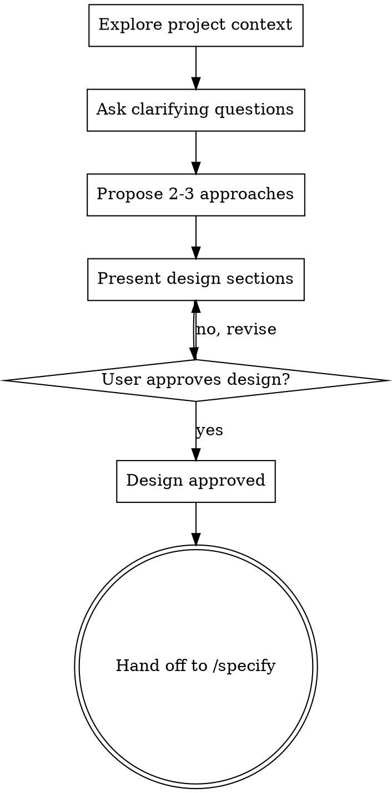

# Brainstorming Ideas Into Designs

Turn an idea into a clear, agreed-upon design through natural collaborative dialogue.

Start by understanding the current project context, then ask questions one at a time to refine the idea. Once you understand what you're building, present the design and get user approval. Writing the formal spec and implementation are out of scope — this skill ends when the design is approved. The natural next step is the `specify` skill, which turns the approved design into a `requirements.md` and `design.md`; hand off to it once the user approves (see **Next step: hand off to `/specify`** below).

<HARD-GATE>
Do NOT write any code, scaffold any project, or take any implementation action until you have presented a design and the user has approved it. This applies to EVERY project regardless of perceived simplicity.
</HARD-GATE>

## Anti-Pattern: "This Is Too Simple To Need A Design"

Every project goes through this process. A todo list, a single-function utility, a config change — all of them. "Simple" projects are where unexamined assumptions cause the most wasted work. The design can be short (a few sentences for truly simple projects), but you MUST present it and get approval.

## Checklist

Complete these in order:

1. **Explore project context** — check files, docs, recent commits
2. **Ask clarifying questions** — one at a time, understand purpose/constraints/success criteria
3. **Propose 2-3 approaches** — with trade-offs and your recommendation
4. **Present design** — in sections scaled to their complexity, get user approval after each section
5. **Stop at approval** — once the user approves the design, the brainstorming is done
6. **Hand off to `/specify`** — recommend running the `specify` skill to formalize the approved design into `requirements.md` and `design.md` before any implementation

## Process Flow

## The Process

**Understanding the idea:**

- Check out the current project state first (files, docs, recent commits)
- Before asking detailed questions, assess scope: if the request describes multiple independent subsystems (e.g., "build a platform with chat, file storage, billing, and analytics"), flag this immediately. Don't spend questions refining details of a project that needs to be decomposed first.
- Respect "one feature at a time": if the idea bundles several features, help the user pick the single one to brainstorm now and set the rest aside.
- For appropriately-scoped ideas, ask questions one at a time to refine the idea
- Prefer multiple choice questions when possible, but open-ended is fine too
- Only one question per message — if a topic needs more exploration, break it into multiple questions
- Focus on understanding: purpose, constraints, success criteria

**Exploring approaches:**

- Propose 2-3 different approaches with trade-offs
- Present options conversationally with your recommendation and reasoning
- Lead with your recommended option and explain why

**Presenting the design:**

- Once you believe you understand what you're building, present the design
- Scale each section to its complexity: a few sentences if straightforward, up to 200-300 words if nuanced
- Ask after each section whether it looks right so far
- Cover: architecture, components, data flow, error handling, testing
- Be ready to go back and clarify if something doesn't make sense

**Design for isolation and clarity:**

- Break the system into smaller units that each have one clear purpose, communicate through well-defined interfaces, and can be understood and tested independently
- For each unit, you should be able to answer: what does it do, how do you use it, and what does it depend on?
- Can someone understand what a unit does without reading its internals? Can you change the internals without breaking consumers? If not, the boundaries need work.

**Working in existing codebases:**

- Explore the current structure before proposing changes. Follow existing patterns.
- Where existing code has problems that affect the work (e.g., a file that's grown too large, unclear boundaries, tangled responsibilities), include targeted improvements as part of the design.
- Don't propose unrelated refactoring. Stay focused on what serves the current goal.
- Don't add dependencies without a clear need.

## Key Principles

- **One question at a time** — Don't overwhelm with multiple questions
- **Multiple choice preferred** — Easier to answer than open-ended when possible
- **One feature at a time** — Brainstorm a single feature; set parallel fronts aside
- **YAGNI ruthlessly** — Remove unnecessary features from all designs
- **Explore alternatives** — Always propose 2-3 approaches before settling
- **Incremental validation** — Present design, get approval before moving on
- **Be flexible** — Go back and clarify when something doesn't make sense

## Next step: hand off to `/specify`

Brainstorming produces an *agreed direction*, not the formal spec. The moment the
user approves the design, close the loop by pointing at the next stage of the
project workflow (`brainstorm → spec → ejecución → verificación → commit`): the
`specify` skill, which writes the approved design up as `requirements.md` (EARS
acceptance criteria) and `design.md`.

Do this rather than sliding straight into implementation — the same reason the
HARD-GATE exists: a written, reviewable spec catches wrong assumptions while
they're still cheap to fix.

- **Recommend it explicitly.** Once the design is approved, say something like:
  "El diseño está aprobado. El siguiente paso es formalizarlo con el skill
  `specify` (genera `requirements.md` y `design.md`). ¿Lo lanzo?"
- **Carry the context forward.** The approved design already covers architecture,
  components, data flow, error handling and testing — feed that into `specify` so
  it doesn't re-interrogate what's already settled; it should reuse those
  decisions and focus on turning behavior into numbered EARS criteria.
- **Don't invoke it silently.** Let the user confirm before starting `specify`,
  since it opens a new phase (and its own requirements-approval gate).
