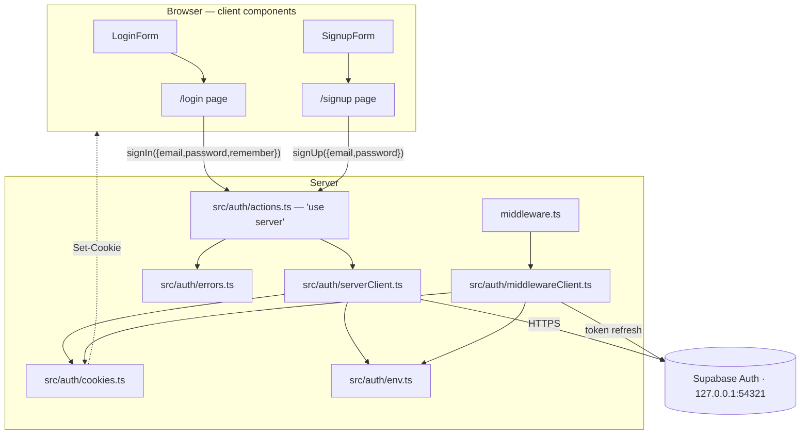

# Design — Sign in and sign up with Supabase Auth

**Status:** Draft
**Date:** 2026-07-30
**Requirements:** ./requirements.md

## Overview

Authentication runs **on the server**. The two screens stay client components
and keep owning their form state, but they never talk to Supabase: they call
Server Actions, and those actions hold the only Supabase client in the app. The
session therefore lives in HTTP cookies written by the server, never in
`localStorage` — which satisfies 3.1/3.2 and means a future route guard is a
middleware edit rather than an architecture change.

Three decisions shape everything below:

1. **`@supabase/ssr` with cookie-backed sessions.** The alternative — the
   browser SDK persisting a session in `localStorage` — is less code today but
   invisible to the server, so no guard, layout, or Route Handler could ever
   know who is signed in.
2. **One frontier module, `src/auth/`.** Everything that imports Supabase lives
   there and exposes plain result objects. Pages, forms and domain code stay
   SDK-free, which is also what makes them testable without the network.
3. **"Remember me" is a cookie-lifetime decision.** Persistence is not a
   property of the session Supabase issues; it is whether we write the cookies
   with an expiry. That choice is itself stored in a cookie so token refresh in
   the middleware can honour it (3.7).

## Architecture



Control flows one way: form → page (format validation) → Server Action →
Supabase → result object → page renders the error or navigates. The middleware
sits outside that flow, on every navigation, doing one job: refresh an expired
access token and re-write the cookies.

New boundary introduced: **nothing outside `src/auth/` may import
`@supabase/*`.** `src/domain/` and `src/components/` remain pure, and the page
components depend only on the action's result type.

## Components and interfaces

### `src/auth/env.ts`

- **Responsibility:** read and validate the Supabase connection settings (5.1,
  5.2). Server-only — the variables are deliberately **not** `NEXT_PUBLIC_`,
  since nothing in the browser creates a Supabase client (5.3).
- **Interface:**

```ts
export interface SupabaseEnv {
  url: string;
  publishableKey: string;
}

/** Throws an Error naming the missing variable. Never returns partial config. */
export function readSupabaseEnv(env?: Record<string, string | undefined>): SupabaseEnv;
```

- **Depends on:** nothing. Pure given its `env` argument, which is what makes
  5.2 testable without touching `process.env`.
- **`.env.local` gains:**

```
SUPABASE_URL=http://127.0.0.1:54321
SUPABASE_PUBLISHABLE_KEY=sb_publishable_…   # from `supabase status`
```

### `src/auth/cookies.ts`

- **Responsibility:** own the persistence rule — the whole of 3.3, 3.4 and 3.7
  in one testable place.
- **Interface:**

```ts
import type { CookieOptions } from "@supabase/ssr";

/** Where the "Remember me" answer is remembered, so refreshes can honour it. */
export const PERSIST_COOKIE = "mis-finanzas:persist";

/** 400 days — the browser cap on cookie lifetime, and Supabase's own default. */
export const PERSIST_MAX_AGE: number;

/**
 * Persistent → an explicit `maxAge`. Browser session → `maxAge` and `expires`
 * are stripped, because @supabase/ssr defaults to a 400-day cookie and a
 * default is exactly what 3.4 must not inherit.
 */
export function applyPersistence(options: CookieOptions, persist: boolean): CookieOptions;

/** Absent or anything but "1" reads as "do not persist" — the safer default. */
export function readsAsPersistent(value: string | undefined): boolean;

/** The name/value/options triple to write alongside the session cookies. */
export function persistCookie(persist: boolean): { name: string; value: string; options: CookieOptions };
```

- **Depends on:** `@supabase/ssr` types only.

### `src/auth/serverClient.ts`

- **Responsibility:** build the Supabase client used inside Server Actions,
  wiring it to Next's request cookie store.
- **Interface:**

```ts
/**
 * `persist` is passed only when a sign-in/sign-up is establishing a session;
 * omitted, the persistence already recorded in PERSIST_COOKIE is preserved.
 */
export async function createAuthClient(persist?: boolean): Promise<SupabaseClient>;
```

- **Notes:** `cookies()` is awaited (Next 15). `getAll` reads the store;
  `setAll` writes each cookie through `applyPersistence`. Cookies are
  `httpOnly: true`, `sameSite: "lax"`, `path: "/"`, and `secure` off on
  `http://127.0.0.1`.
- **Depends on:** `@supabase/ssr`, `next/headers`, `env.ts`, `cookies.ts`.

### `src/auth/middlewareClient.ts`

- **Responsibility:** the same client shaped for the middleware's
  request/response pair, so a refreshed token reaches the browser (3.6, 3.7).
- **Interface:**

```ts
/** Returns the response carrying any refreshed session cookies. */
export async function refreshSession(request: NextRequest): Promise<NextResponse>;
```

- **Notes:** reads cookies from `request`, writes them onto both `request` (so
  the rendered route sees them) and `response`. Calls `supabase.auth.getUser()`
  — the call that actually performs the refresh — and swallows its failure, per
  3.8: a request must never fail because a session could not be refreshed.
- **Depends on:** `@supabase/ssr`, `next/server`, `env.ts`, `cookies.ts`.

### `src/auth/errors.ts`

- **Responsibility:** turn whatever the SDK threw into copy for the screen
  (Requirement 4). Pure, and it never sees the password (1.6).
- **Interface:**

```ts
export type Screen = "sign-in" | "sign-up";

export type AuthFailure =
  | { kind: "banner"; message: string }
  | { kind: "field"; field: CredentialsField; message: string };

export interface MappedAuthError {
  failure: AuthFailure;
  /** false → the caller logs the raw detail server-side (4.6). */
  recognized: boolean;
}

export function mapAuthError(error: unknown, screen: Screen): MappedAuthError;
```

- **Notes:** it narrows on the `code`/`status` fields structurally rather than
  with `instanceof`, so tests construct plain objects instead of importing SDK
  error classes.
- **Depends on:** `src/domain/credentials.ts` (for `CredentialsField`).

### `src/auth/actions.ts`

- **Responsibility:** the only thing the screens call. `"use server"`.
- **Interface:**

```ts
export type AuthResult = { ok: true } | { ok: false; failure: AuthFailure };

export async function signIn(input: {
  email: string;
  password: string;
  remember: boolean;
}): Promise<AuthResult>;

export async function signUp(input: {
  email: string;
  password: string;
}): Promise<AuthResult>;
```

- **Notes:** each action re-runs the domain validation server-side before
  calling Supabase — a Server Action is a public endpoint, and the client-side
  check in the page is a UX affordance, not a guarantee. `signUp` passes
  `persist: true` (3.5). Neither action redirects; they return, and the page
  navigates, which keeps the "on failure nothing navigates" rule (1.5, 2.8) in
  one place. On `recognized: false` the action `console.error`s the raw error
  (4.6).
- **Depends on:** `serverClient.ts`, `errors.ts`, `src/domain/credentials.ts`.

### `middleware.ts` (project root)

- **Responsibility:** run `refreshSession` on every navigable request.
- **Interface:**

```ts
export async function middleware(request: NextRequest): Promise<NextResponse>;
export const config = {
  matcher: ["/((?!_next/static|_next/image|favicon.ico|api/).*)"],
};
```

- **Notes:** it only refreshes. The redirect-if-signed-out is deliberately
  absent (out of scope) and is the single edit a future guard needs.

### `src/domain/credentials.ts` (extended)

- **Responsibility:** unchanged for sign-in; gains the registration rule (2.6).
- **Interface:**

```ts
/** Mirrors `minimum_password_length` in supabase/config.toml. */
export const MIN_PASSWORD_LENGTH = 6;

/** Sign-up: everything validateCredentials checks, plus minimum length. */
export function validateNewCredentials(input: CredentialsInput): ValidateCredentialsResult;
```

- **Notes:** built on top of `validateCredentials`, not a copy of it, so the
  email rule cannot drift between the two screens.

### `src/components/BrandPanel.tsx` (extracted)

- **Responsibility:** the teal half of the split, moved verbatim out of
  `app/login/page.tsx` so both screens share it (2.9). No behaviour change.

### `src/components/SignupForm.tsx` (new)

- **Responsibility:** the sign-up form column — same `TextField`,
  `PasswordField` and `Button` as `LoginForm`, without "Remember me" and
  "Forgot password?", with a link back to sign-in (2.2).
- **Interface:**

```ts
export interface SignupSubmission { email: string; password: string }

export function SignupForm(props: {
  onSubmit: (submission: SignupSubmission) => void;
  errors?: CredentialsError[];
  saveError?: string | null;
}): JSX.Element;
```

- **Copy (fixed here, since no mockup covers this screen).** English, mirroring
  the login column's voice. These are the exact strings the tests assert on:

| Element | String |
|---|---|
| Heading (`<h1>`) | `Create your account` |
| Subtitle | `Start building your Northstar plan.` |
| Email field label / placeholder | `Email` / `you@example.com` |
| Password field label / placeholder | `Password` / `Create a password` |
| Submit button | `Create account` |
| Footer line | `Already have an account?` + link `Sign in` |

### Changed and removed

- `app/login/page.tsx` — `handleSubmit` becomes async and calls `signIn`;
  `saveSession` disappears; "Create an account" becomes a link to `/signup`.
  `LoginForm`'s `onSubmit` return type narrows from `boolean` to `void` (the
  form already ignored it: nothing is cleared on success).
- `app/signup/page.tsx` — new, mirroring the login page against `signUp`.
- **`src/storage/sessionStorage.ts` and `sessionStorage.test.ts` are deleted**
  (3.2). Its only importer is `app/login/page.tsx`; the mention in
  `profileStorage.ts` is a comment, and `know-me/page.test.tsx` uses the
  browser's native `sessionStorage`, not this module.

## Data models

```ts
// src/auth/errors.ts — what a screen must render
type AuthFailure =
  | { kind: "banner"; message: string }        // shown in the form's alert row
  | { kind: "field"; field: CredentialsField; message: string }; // annotates one input

// src/auth/actions.ts — what a screen receives
type AuthResult = { ok: true } | { ok: false; failure: AuthFailure };
```

The two-shape failure exists because Requirement 4 has two kinds of message: a
banner (4.1, 4.2, 4.4, 4.5, 4.6) and a field annotation (4.3, weak password).
Modelling it as a union lets each page route the failure without inspecting
error codes it should not know about.

**Cookies written**

| Cookie | Contents | Lifetime |
|---|---|---|
| `sb-<ref>-auth-token…` (owned by `@supabase/ssr`) | access + refresh token | `maxAge` when persistent; none when browser-session |
| `mis-finanzas:persist` | `"1"` or `"0"` | same rule as above |

No other persisted state. Nothing about the user is written to `localStorage`.

## Data flow

**Sign-in, success with "Remember me" (1.1, 1.2, 3.1, 3.3)**

1. `LoginForm` submits `{ email, password, remember: true }`.
2. `app/login/page.tsx` runs `validateCredentials`. It passes.
3. It clears any previous error message (4.8) and awaits `signIn(...)`.
4. The action re-validates, builds `createAuthClient(true)` and calls
   `supabase.auth.signInWithPassword({ email, password })`.
5. Supabase returns a session; the SDK's `setAll` fires; `applyPersistence`
   stamps `maxAge` on each cookie, and `persistCookie(true)` is written beside
   them.
6. The action returns `{ ok: true }`; the page calls `router.push("/onboarding/profile")`
   then `router.refresh()` so the server re-renders with the new cookies.

**Sign-in, wrong password (1.4, 1.5, 4.1)**

1. Steps 1–4 as above.
2. Supabase returns an `AuthApiError` with code `invalid_credentials`.
3. `mapAuthError(error, "sign-in")` returns
   `{ failure: { kind: "banner", message: "Invalid email or password." }, recognized: true }`.
4. The action returns `{ ok: false, failure }`. No cookie was written, so no
   session exists.
5. The page sets `saveError`, does not navigate, and the typed values stay in
   the form's own state — it was never unmounted.

**Token refresh mid-navigation (3.6, 3.7, 3.8)**

1. The user navigates; `middleware.ts` runs before the route.
2. `refreshSession` builds a client over `request.cookies` and calls
   `getUser()`; the SDK notices the access token expired and redeems the
   refresh token.
3. `setAll` fires; `readsAsPersistent(request.cookies.get(PERSIST_COOKIE))`
   decides the lifetime, so a browser session stays a browser session.
4. If the refresh fails, the error is swallowed: the response goes out with the
   session cookies cleared by the SDK and the route renders signed-out.

**Sign-up (2.3, 2.4, 3.5)** — same as sign-in with `validateNewCredentials`,
`supabase.auth.signUp`, and `persist: true`. Because `enable_confirmations =
false` in `supabase/config.toml`, the response already carries a session, so
step 6 is identical. *If that config flag were ever flipped to `true`, 2.4
breaks:* `signUp` would return a user without a session and the app would
navigate to `/onboarding/profile` unauthenticated. The action guards against
this by treating "registered but no session" as an unrecognized failure rather
than a success.

## Error handling

| Condition | Handling | Related requirement |
|---|---|---|
| Format invalid (email or empty password) on `/login` | Page annotates the field; no action call | 1.3 |
| Email malformed on `/signup` | Page annotates email; no action call | 2.5 |
| Password shorter than 6 on `/signup` | Page annotates password; no action call | 2.6 |
| Format invalid but the action was called anyway (direct POST) | Action re-validates and returns a field failure | 1.3, 2.5, 2.6 |
| `invalid_credentials` | Banner "Invalid email or password." | 1.4, 4.1 |
| `user_already_exists` / `email_exists` | Banner "That email is already registered. Sign in instead." | 2.7, 4.2 |
| `weak_password` | Field failure on `password` carrying the service's stated requirement | 4.3 |
| `over_request_rate_limit` / HTTP 429 | Banner "Too many attempts. Wait a moment and try again." | 4.4 |
| Fetch failure / `AuthRetryableFetchError` / status 0 | Banner "Could not reach the server. Please try again." | 4.5 |
| Any other error | Banner "Something went wrong. Please try again."; `recognized: false` → action logs the raw error | 4.6 |
| Registered but no session returned | Treated as unrecognized failure; nothing navigates | 2.4 |
| `SUPABASE_URL` or `SUPABASE_PUBLISHABLE_KEY` missing | `readSupabaseEnv` throws naming the variable; the action never runs | 5.2 |
| Refresh fails in middleware | Swallowed; request proceeds signed-out | 3.8 |

Every banner renders in the existing `role="alert"` paragraph of the form (4.7),
and both pages clear `errors` and `saveError` at the start of each submit (4.8).
No failure path calls `router.push`.

## Testing strategy

TDD as usual: `npm run typecheck` and `npm test` are the gate. Vitest never
reaches the network — `src/auth/actions.ts` is the seam, mocked with `vi.mock`
in the page tests, and everything below it is either pure or tested against a
fake cookie store.

- **Unit — `errors.test.ts`:** one case per row of the error table, both
  screens, plus an unrecognized error asserting `recognized: false` and that the
  raw message does not leak into `failure.message`. → 4.1–4.6
- **Unit — `cookies.test.ts`:** `applyPersistence` adds `maxAge` when
  persisting; strips both `maxAge` and `expires` when not; `readsAsPersistent`
  treats absent/`"0"`/garbage as false. → 3.3, 3.4, 3.7
- **Unit — `env.test.ts`:** both variables present → parsed; each one missing or
  empty → throws naming *that* variable. → 5.1, 5.2
- **Unit — `credentials.test.ts` (extended):** `validateNewCredentials` rejects
  a 5-character password on the `password` field, accepts 6, and still rejects
  the malformed emails the existing tests cover. → 2.5, 2.6
- **Component — `SignupForm.test.tsx`:** renders both fields and the submit
  button, reports typed values, annotates per-field errors, shows `saveError` in
  a `role="alert"` node, and has no "Remember me" control. → 2.9, 4.7
- **Component — `LoginForm.test.tsx` (adjusted):** unchanged behaviour under the
  narrowed `onSubmit` type.
- **Page — `login/page.test.tsx`:** with `signIn` mocked — valid submit calls it
  with the normalized email and the `remember` flag and navigates on `{ok:true}`;
  a banner failure renders the message and does **not** navigate; an invalid
  email never calls the action; a second submit clears the previous banner.
  → 1.1–1.5, 3.3, 4.8
- **Page — `signup/page.test.tsx`:** the same shape against `signUp`, plus the
  already-registered banner and the field failure landing on `password`.
  → 2.3–2.8, 4.2, 4.3
- **Edge cases explicitly covered:** unrecognized error code; short password
  rejected client-side *and* server-side; persistence preserved across refresh;
  registered-but-no-session.
- **Not covered by unit tests, by design:** that the cookies actually reach the
  browser and that Supabase accepts the credentials. That is the e2e loop's job
  (`/verify-implementation`), which drives the real local stack. Its sign-in
  case must first register a unique email through the UI, because seeding a
  known password would mean committing a password hash.

## Design decisions and trade-offs

- **Decision:** Server Actions rather than Route Handlers or a browser client —
  **Rationale:** they give server-side cookie writes with no new URL surface and
  no hand-rolled fetch/JSON layer, and they keep the pages' existing
  "validate → submit → render error" shape intact. **Alternative considered:**
  `POST /api/auth/sign-in`, rejected as reimplementing by hand what the
  framework already provides; the browser SDK, rejected because a
  `localStorage` session is invisible to the server.
- **Decision:** cookies are `httpOnly` — **Rationale:** nothing in the browser
  needs to read the token, and script-readable auth cookies are the failure mode
  we are moving *away* from. **Trade-off:** if a browser-side Supabase client is
  ever added (realtime, direct queries), this must be relaxed and the env vars
  renamed to `NEXT_PUBLIC_*`. Recorded here so that day is a decision, not a
  surprise.
- **Decision:** persistence stored in its own cookie — **Rationale:** the
  middleware refreshes tokens long after the sign-in request is gone, and 3.7
  requires it to know the original choice. **Alternative considered:** inferring
  it from the existing cookie's expiry, rejected as unreadable (the server sees
  cookie values, not their attributes).
- **Decision:** the actions re-validate — **Rationale:** a Server Action is
  reachable without the page. **Trade-off:** the rule runs twice; acceptable
  because both calls go through the same `src/domain/credentials.ts` function,
  so there is one rule, not two.
- **Decision:** non-`NEXT_PUBLIC_` environment variable names — **Rationale:**
  the keys are only read on the server, and the prefix would ship them to the
  browser for no reason (5.3). **Alternative considered:** the conventional
  `NEXT_PUBLIC_SUPABASE_*`, rejected as advertising a browser client the design
  does not have.
- **Decision:** a separate `SignupForm` instead of a mode flag on `LoginForm` —
  **Rationale:** the two screens differ in copy, fields and controls; one
  component with two modes would make every branch conditional and every test
  parameterized. **Trade-off:** some structural duplication, contained by
  sharing `TextField`/`PasswordField`/`Button`/`BrandPanel`.
- **Decision:** delete `sessionStorage.ts` outright — **Rationale:** its own
  doc comment justifies itself with "there is no auth backend"; keeping it would
  create a second, staler answer to "who is signed in" (3.2). **Alternative
  considered:** keeping it as a UI-only email cache, rejected as two sources of
  truth.
